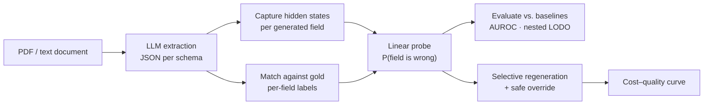

# Probe-Based Trust Signals for Structured Information Extraction

[](https://github.com/PC0907/NLP_Lab/actions/workflows/ci.yml)
[](https://www.python.org/)
[](LICENSE)

Linear probes on LLM hidden states that flag **which extracted fields are likely wrong**, and use that signal to decide
**which fields to regenerate**.

---

## Motivation

LLMs are widely used to turn documents (papers, invoices, contracts, financial filings) into structured JSON. Errors in
that output are silent: a hallucinated or mismatched field looks exactly as plausible as a correct one. Regenerating
everything is expensive; regenerating nothing leaves the errors in.

> **Research question.** Can probe-based trust signals identify risky extracted fields well enough to improve the
> cost–quality trade-off of selective regeneration, compared to black-box baselines such as token log-probabilities,
> P(True) and self-consistency?

The probe is a means, not the end. The headline artefact is a cost–quality curve: extraction accuracy vs. compute
spent on regeneration, for probe-guided selection versus the baselines.

## Method



1. **Extract.** Run an open-weights LLM over benchmark documents with the target JSON schema in the prompt.
2. **Label.** Compare each extracted field to gold annotations (match, value mismatch, hallucination, omission, type
   mismatch) with a schema-aware matcher.
3. **Capture.** Record hidden states at the tokens that produced each field, across a sweep of layers and token
   positions (last token, mean, all tokens).
4. **Probe.** Train logistic-regression probes to predict per-field errors.
5. **Evaluate.** Compare against black-box baselines under *nested leave-one-document-out* CV, so that layer selection
   never sees the held-out document.
6. **Regenerate.** Use probe risk scores to choose which fields to re-extract, with a safe-override policy that only
   replaces a value when the probe is confident the new value is better.

Follow-up analyses cover cross-model and cross-dataset transfer, parser sensitivity (PyMuPDF / Docling / Camelot),
mass-mean vs. logistic probes, and activation steering along the probe direction to test causal involvement.

**Models studied:** Qwen3.5 (2B / 4B / 9B), Gemma 3 (4B / 12B), Llama 3.1 8B, DeepSeek-R1-Distill-Qwen-7B.
**Data:** ExtractBench, RealKIE, an insurance-claims set, and SOB (Structured Output Benchmark).

## Repository layout

```
.
├── src/probe_extraction/   # Installable library
│   ├── data/               #   benchmark loaders (ExtractBench, RealKIE, SOB, insurance) + PDF parsing
│   ├── models/             #   Hugging Face model wrapper with activation capture
│   ├── extraction/         #   prompting, generation, JSON parsing, field→token alignment
│   ├── labeling/           #   schema-aware gold matcher and value comparison
│   ├── probes/             #   linear probes
│   └── baselines/          #   log-prob, hand-crafted and combined baselines, LODO evaluation
├── scripts/                # Main pipeline, numbered by stage (00 → 10)
├── experiments/            # Follow-up studies: transfer, steering, grid, mass-mean, …
├── tools/                  # Diagnostics, dataset checks and model smoke tests
├── configs/                # One YAML per experiment (model × dataset × parser × pooling)
├── slurm/                  # SLURM job scripts and cluster environment setup
├── tests/                  # Unit tests (matcher, value comparison, benchmark loader)
└── docs/                   # HPC guide, troubleshooting, research notes
```

## Installation

Requires Python 3.10+ and, for extraction, a CUDA GPU (developed on A40/A100; the 4B models fit in bf16 on 16 GB).

```bash
git clone https://github.com/PC0907/NLP_Lab.git
cd NLP_Lab
python -m venv .venv && source .venv/bin/activate
pip install -r requirements.txt
pip install -e ".[dev]"
```

Gated models (Llama, Gemma) need a Hugging Face token. Put it in a `.env` file at the repo root (already
git-ignored):

```bash
HF_TOKEN=hf_...
```

Download [ExtractBench](https://github.com/ContextualAI/extract-bench) into `data/extract-bench/` (or set
`EXTRACT_BENCH_PATH`). SOB can be fetched with `python scripts/00_download_sob.py`.

## Quick start

Every stage takes the same config file. Outputs go to `artifacts/<experiment.name>/`.

```bash
CFG=configs/exp_qwen35_4b_pymupdf.yaml

python scripts/01_extract.py     --config $CFG   # GPU: extractions + activations
python scripts/02_label.py       --config $CFG   # per-field correctness labels
python scripts/03_train_probe.py --config $CFG   # probes per layer
python scripts/04_evaluate.py    --config $CFG   # probe vs. baselines
python scripts/05b_nested_lodo.py --config $CFG  # nested LODO (reported metric)
```

Stages 2 onward run on CPU from cached artifacts.

### Pipeline stages

| Script | Purpose |
|---|---|
| `00_download_sob.py` | Download the SOB dataset |
| `01_extract.py` | Run the LLM; save extractions, token log-probs and activations |
| `02_label.py` | Label each extracted field against gold |
| `03_train_probe.py` | Train linear probes per layer |
| `04_evaluate.py` | Probe vs. baselines (AUROC / AUPRC) |
| `05_lodo_cv.py` | Leave-one-document-out CV |
| `05b_nested_lodo.py` | Nested LODO with inner-loop layer selection; reports pooled out-of-fold AUROC |
| `05c_nested_groupkfold.py` | Nested grouped K-fold for many small records (SOB) |
| `06_span_aggregation.py` | Last-token vs. mean vs. span-max field representations |
| `07_regen_single.py` | Single-field regeneration sanity check |
| `08_fixability_filter.py` | Is the gold value present in the parsed text at all? |
| `09_regen_sweep.py` | Selective regeneration cost–quality sweep |
| `10_gpu_baselines.py` | P(True) and self-consistency baselines |
| `10_regen_select.py` | Multi-sample regeneration with probe-based selection and safe override |

See [`experiments/README.md`](experiments/README.md) and [`tools/README.md`](tools/README.md) for the rest.

## Running on a SLURM cluster

All experiments were run with the job scripts in [`slurm/`](slurm/). Submit them from the repo root:

```bash
sbatch slurm/run_extraction.sh
```

[`docs/hpc.md`](docs/hpc.md) covers cluster setup and [`docs/troubleshooting.md`](docs/troubleshooting.md) collects
known failure modes and fixes.

## Evaluation protocol

- **Nested leave-one-document-out.** The outer loop holds out one document. The inner loop picks the probe layer (and
  regeneration threshold) using only the remaining documents.
- **Pooled out-of-fold AUROC** is the reported metric. Every field is scored by a probe that never saw its document,
  and AUROC is computed once over all held-out fields. Per-fold means are also logged, but they are unstable when
  single documents have few fields.
- **Strict and lenient matchers** are both reported for regeneration outcomes (fields fixed, fields broken, net).

## Tests

```bash
pytest
```

Loader tests that need ExtractBench are skipped automatically when `data/extract-bench/` is absent.

## Status

Active research project. Results and the write-up are being finalised; the dated research log is in
[`docs/notes/`](docs/notes/).

## Citation

If you use this code, please cite it using the metadata in [`CITATION.cff`](CITATION.cff).

## License

[MIT](LICENSE) © 2026 Syed Ali Mehdi Rizvi
