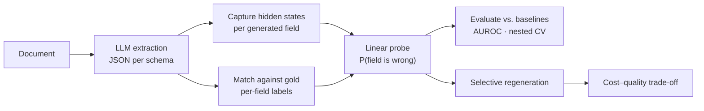

# Probe-Based Trust Signals for Structured Information Extraction

[](https://github.com/PC0907/NLP_Lab/actions/workflows/ci.yml)
[](https://www.python.org/)
[](LICENSE)

Linear probes on LLM hidden states that flag **which extracted fields are likely wrong**, and use that signal to decide
**which fields to regenerate**.

---

## Motivation

LLMs are widely used to turn documents (papers, invoices, contracts, financial filings, multi-hop QA passages) into
structured JSON. Errors in that output are silent: a hallucinated or mismatched field looks exactly as plausible as a
correct one. Regenerating everything is expensive; regenerating nothing leaves the errors in.

> **Research question.** Can probe-based trust signals identify risky extracted fields well enough to improve the
> cost–quality trade-off of selective regeneration, compared to black-box baselines such as token log-probabilities,
> P(True) and self-consistency?

## Method



1. **Extract.** Run an open-weights LLM over benchmark documents with the target JSON schema in the prompt.
2. **Label.** Compare each extracted field to gold annotations with a schema-aware matcher (match, value mismatch,
   hallucination, omission, type mismatch).
3. **Capture.** Record hidden states at the tokens that produced each field, and for reasoning models, over the
   `<think>` trace.
4. **Probe.** Train logistic-regression probes to predict per-field errors.
5. **Evaluate.** Compare against black-box baselines under document-level cross-validation, so that no probe is
   scored on a document it was trained on.
6. **Regenerate.** Re-extract the fields the probe flags and measure what actually gets repaired or damaged.

## Research tracks

The project has two tracks that share the library (`src/probe_extraction/`) and pipeline stages 01–04, and each add
their own stages 05–10.

| | **ExtractBench track** | **Reasoning-trace track** |
|---|---|---|
| Lead | Syed Ali Mehdi Rizvi | Adnan Bhat |
| Question | Do answer-token probes beat black-box signals on real PDF extraction, and does probe-guided regeneration pay off? | Does a reasoning model's chain of thought carry error information beyond the answer token, and what is acting on it worth? |
| Models | Qwen3.5 (2B / 4B / 9B), Gemma 3 (4B / 12B), Llama 3.1 8B | DeepSeek-R1-Distill-Qwen-7B |
| Data | ExtractBench (PDFs), RealKIE, insurance claims; transfer to SOB | SOB (Structured Output Benchmark), HotpotQA multi-hop subset |
| Scripts | [`scripts/extractbench/`](scripts/extractbench/), [`experiments/`](experiments/), [`tools/`](tools/) | [`scripts/reasoning/`](scripts/reasoning/) |
| Configs | [`configs/extractbench/`](configs/extractbench/) | [`configs/reasoning/`](configs/reasoning/) |
| Jobs | [`slurm/extractbench/`](slurm/extractbench/) | [`slurm/reasoning/`](slurm/reasoning/) |
| Docs | [`docs/extractbench/`](docs/extractbench/) | [`docs/reasoning/`](docs/reasoning/): start with [PROJECT_OVERVIEW](docs/reasoning/PROJECT_OVERVIEW.md) |

**Reasoning-trace track highlights** (974 SOB documents; details and caveats in
[PROJECT_OVERVIEW](docs/reasoning/PROJECT_OVERVIEW.md)):

- Probing the `<think>` trace beats the model's own token confidence: AUROC **0.827** vs **0.753**.
- Regeneration was actually run and measured rather than simulated: the measured repair rate is **0.233**, against
  the 0.700 a simulated cost model assumed.
- Requiring the model to agree with itself lifts the repair-to-damage ratio from **0.9** to **4.8**.

**ExtractBench track** results are being finalised; the dated research log is in
[`docs/extractbench/`](docs/extractbench/).

## Repository layout

```
.
├── src/probe_extraction/   # Shared library
│   ├── data/               #   loaders: ExtractBench, RealKIE, SOB, insurance claims; PDF parsing
│   ├── models/             #   Hugging Face wrapper with activation capture
│   ├── extraction/         #   prompting, generation, JSON parsing, field→token alignment, reasoning traces
│   ├── labeling/           #   schema-aware gold matcher and value comparison
│   ├── probes/             #   linear probes
│   ├── baselines/          #   log-prob, hand-crafted and combined baselines, LODO evaluation
│   ├── regen/              #   measured-regeneration accounting
│   └── utils/
├── scripts/                # Shared stages 00–04 (download, extract, label, train, evaluate)
│   ├── extractbench/       #   ExtractBench track stages 05–10 and analyses
│   └── reasoning/          #   Reasoning track stages 05–10
├── experiments/            # ExtractBench follow-ups: transfer, steering, parser grid, mass-mean, …
├── tools/                  # Diagnostics, dataset checks, model smoke tests
├── configs/                # default.yaml + one folder of experiment YAMLs per track
├── slurm/                  # Shared env setup + one folder of SLURM jobs per track
├── figures/                # Paper figures (reasoning track)
├── archive/reasoning/      # Superseded reasoning-track stages, kept so earlier results stay reproducible
├── tests/                  # Unit tests for both tracks
└── docs/                   # HPC guide, troubleshooting, per-track documentation and research logs
```

## Installation

Requires Python 3.10+ and, for extraction, a CUDA GPU (developed on A40/A100).

```bash
git clone https://github.com/PC0907/NLP_Lab.git
cd NLP_Lab
python -m venv .venv && source .venv/bin/activate
pip install -r requirements.txt
pip install -e ".[dev]"
```

Gated models (Llama, Gemma) need a Hugging Face token. Put it in a `.env` file at the repo root (already
git-ignored):

```bash
HF_TOKEN=hf_...
```

Data:

- **ExtractBench:** clone [ContextualAI/extract-bench](https://github.com/ContextualAI/extract-bench) into
  `data/extract-bench/`, or set `EXTRACT_BENCH_PATH`.
- **SOB:** `python scripts/00_download_sob.py`.

## Quick start

Every stage takes the same config file. Outputs go to `artifacts/<experiment.name>/`.

**ExtractBench track**

```bash
CFG=configs/extractbench/exp_qwen35_4b_pymupdf.yaml

python scripts/01_extract.py     --config $CFG    # GPU: extractions + activations
python scripts/02_label.py       --config $CFG    # per-field correctness labels
python scripts/03_train_probe.py --config $CFG    # probes per layer
python scripts/04_evaluate.py    --config $CFG    # probe vs. baselines
python scripts/extractbench/05b_nested_lodo.py --config $CFG   # nested LODO (reported metric)
```

**Reasoning-trace track**

```bash
CFG=configs/reasoning/exp_deepseek_r1_7b_sob_attr_1k.yaml

python scripts/01_extract.py --config $CFG --resume          # GPU: extraction + reasoning-trace states
python scripts/02_label.py   --config $CFG
python scripts/reasoning/05_reasoning_attribution_lodo.py --config $CFG
# … stages 06–10; see docs/reasoning/REASONING_TRACK.md for the full sequence and flags
```

Stages after extraction run on CPU from cached artifacts.

## Running on a SLURM cluster

All experiments were run with the job scripts in [`slurm/`](slurm/). Submit them from the repo root:

```bash
sbatch slurm/extractbench/run_extraction.sh
```

[`docs/hpc.md`](docs/hpc.md) covers cluster setup and [`docs/troubleshooting.md`](docs/troubleshooting.md) collects
known failure modes and fixes.

## Labeling modes

`labeling.match_mode` in the config controls how extracted values are compared to gold:

| Mode | Leaf comparison | Used by |
|---|---|---|
| `strict` | Exact | — |
| `auto` (default) | Type-aware: numeric tolerance, date parsing, case-insensitive text | ExtractBench track |
| `structure_aware` | As `auto`, plus flat values matched against gold object leaves | Reasoning track |

`02_label.py` saves labels for the configured mode and writes an error-rate comparison across all three to
`labels/_definition_comparison.json`.

## Tests

```bash
pytest
```

Tests that need ExtractBench are skipped automatically when `data/extract-bench/` is absent.

## Authors

- **Syed Ali Mehdi Rizvi** ([@PC0907](https://github.com/PC0907)): ExtractBench track
- **Adnan Bhat** ([@Adnanilahi](https://github.com/Adnanilahi)): reasoning-trace track

## Citation

If you use this code, please cite it using the metadata in [`CITATION.cff`](CITATION.cff).

## License

[MIT](LICENSE)
